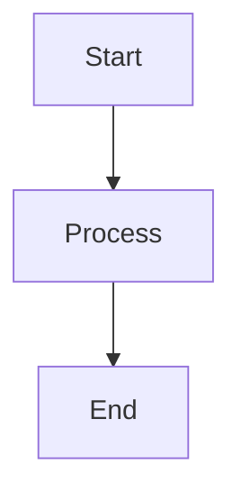

# Plan: Add Mermaid Diagram Support

## Context

The PHX spoke (and others) contain tree-structure reference diagrams written as ASCII art in plain code blocks (e.g., `phx/reference/wufi-xml-schema.md`). Mermaid's TreeView syntax (and other diagram types) would provide better rendering. Currently, Astro's markdown pipeline has zero plugins — ```` ```mermaid ```` blocks render as plain `<pre><code>` with no diagram rendering. This needs hub-level changes; spokes just write standard markdown.

## Approach: Client-Side Rendering via CDN

No npm `mermaid` dependency. No build-time rendering. A small remark plugin transforms the MDAST, and a script tag loads Mermaid from CDN at runtime.

---

## Changes

### 1. Create `src/plugins/remark-mermaid.ts` (new file)

A remark plugin (~25 lines) that walks the MDAST and replaces `code` nodes where `lang === "mermaid"` with `html` nodes containing:

```html
<div class="mermaid" data-pagefind-ignore>
{raw mermaid text}
</div>
```

Key details:
- Inline tree walker (no `unist-util-visit` dependency — avoids pnpm hoisting issues)
- Only touches `code` nodes with `lang === "mermaid"` — all other code blocks pass through unchanged
- `data-pagefind-ignore` prevents Pagefind from indexing raw mermaid syntax text (e.g., "graph TD", "A --> B")
- Uses `<div>` not `<pre>` — Mermaid.js expects this for its renderer
- HTML-escapes the mermaid text to prevent XSS from content

### 2. Update `astro.config.ts`

Register the remark plugin:

```typescript
import { defineConfig } from "astro/config";
import remarkMermaid from "./src/plugins/remark-mermaid";

export default defineConfig({
  output: "static",
  site: "https://docs.passivehousetools.com",
  markdown: {
    remarkPlugins: [remarkMermaid],
  },
});
```

### 3. Update `src/layouts/BaseLayout.astro`

Add a conditional Mermaid loader script before `</body>` (after the existing theme toggle script). Pattern:

```html
<script is:inline>
  // Only load Mermaid if the page has mermaid diagrams
  (function () {
    if (!document.querySelector('.mermaid')) return;
    var theme = document.documentElement.getAttribute('data-theme') === 'dark' ? 'dark' : 'neutral';
    var s = document.createElement('script');
    s.src = 'https://cdn.jsdelivr.net/npm/mermaid@11/dist/mermaid.min.js';
    s.onload = function () {
      mermaid.initialize({ startOnLoad: true, theme: theme, securityLevel: 'strict' });
      mermaid.run();
    };
    document.head.appendChild(s);
  })();
</script>
```

Key details:
- **Conditional loading**: Checks for `.mermaid` elements first. Pages without diagrams never fetch the ~200KB library.
- **`is:inline`** (not bundled): Must use `is:inline` because the script references a CDN resource that only exists at runtime. Matches the pattern already used by SearchModal.
- **Theme-aware**: Reads `data-theme` attribute (already set by the theme-flash-prevention script in `<head>`) to pick `dark` or `neutral` Mermaid theme.
- **`securityLevel: 'strict'`**: Prevents click handlers and other interactive features in diagrams (defense-in-depth, even though spoke content is trusted).
- **No re-render on theme toggle**: Diagrams keep their initial theme. A page refresh updates them. Adding re-render logic would require storing source text and adds complexity not worth it now.

### 4. Update `src/styles/global.css`

Add after the existing `.article pre code` block (~line 910):

```css
/* Mermaid diagrams */
.article .mermaid {
  margin: 0 0 20px 0;
  text-align: center;
  overflow-x: auto;
}
.article .mermaid svg {
  max-width: 100%;
  height: auto;
}
```

Minimal styling — lets Mermaid control the diagram appearance while ensuring it fits within the article flow and handles overflow for wide diagrams.

---

## What Does NOT Change

| Component | Why no change needed |
|---|---|
| `fetch_spokes.py` | Copies raw markdown as-is — no code block processing |
| `build_llm_docs.py` | Strips HTML `<div>` blocks, but processes raw markdown BEFORE Astro builds. The raw `.md` files still contain ```` ```mermaid ```` fenced blocks (not `<div>`s), so they pass through unchanged. LLMs can read mermaid syntax natively — this is actually a benefit. |
| `build_llm_nav.py` | Only handles nav metadata |
| `build.yml` (CI/CD) | Build steps unchanged: fetch → LLM docs → astro build → pagefind → deploy |
| `content.config.ts` | Content collection schema is unaffected |
| `package.json` | No new npm dependencies (CDN for mermaid, inline walker instead of unist-util-visit) |
| Spoke repos | No structural changes needed. Authors just write ```` ```mermaid ```` blocks in their `.md` files. |

## Processing Pipeline (showing where Mermaid fits)

```
Spoke repos ──[fetch_spokes.py]──> src/content/docs/*.md (raw markdown)
                                          │
                    ┌─────────────────────┼───────────────────────┐
                    ▼                                             ▼
          build_llm_docs.py                              astro build
          (strips frontmatter,                    (remark-mermaid plugin
           strips <div> HTML,                      transforms ```mermaid```
           preserves ```mermaid```)                 to <div class="mermaid">)
                    │                                             │
                    ▼                                             ▼
           public/llm/*.md                              dist/*.html
           (clean markdown,                     (static HTML with <div class="mermaid">
            mermaid blocks intact)                + CDN script for client rendering)
                                                                  │
                                                                  ▼
                                                          pagefind --site dist
                                                   (indexes HTML, skips mermaid
                                                    divs via data-pagefind-ignore)
```

## Risk Analysis

| Risk | Mitigation |
|---|---|
| CDN unavailable | Diagrams show raw mermaid text (readable, just not pretty). No site breakage. |
| Plugin breaks non-mermaid code blocks | Plugin only targets `node.lang === "mermaid"` — explicit match, no regex |
| LLM docs contain raw mermaid instead of tree | Mermaid syntax is LLM-readable; arguably better than ASCII art for structured data |
| Pagefind indexes mermaid syntax | `data-pagefind-ignore` on the container prevents this |
| Theme mismatch after toggle | Acceptable tradeoff — refresh fixes it. Re-render adds significant complexity. |
| Mermaid TreeView is experimental | Not a hub concern — spoke authors choose which Mermaid diagram types to use. If TreeView isn't stable enough, they can use other types (flowchart, etc.) |
| `build_llm_docs.py` strips the rendered `<div>` | Not an issue — LLM script processes raw `.md` files (before Astro), which still contain fenced code blocks, not HTML divs |

## Verification

1. **Dev server**: `pnpm dev` → create a test page with a ```` ```mermaid ```` block → confirm diagram renders
2. **Non-mermaid code blocks**: Confirm Python/YAML/bash code blocks still render as `<pre><code>` with no changes
3. **LLM docs**: Run `python scripts/build_llm_docs.py` → confirm mermaid blocks appear as-is in `public/llm/` output
4. **Pagefind**: Run `pnpm build` → search for mermaid keywords → confirm no results from diagram syntax
5. **No-JS fallback**: Disable JavaScript → confirm raw mermaid text is visible (not a blank space)
6. **Dark mode**: Toggle theme before page load → confirm diagram uses dark theme
7. **Pages without mermaid**: Check Network tab → confirm `mermaid.min.js` is NOT loaded

## Spoke Author Guidance

After hub changes are deployed, spoke authors can use mermaid immediately. Usage in any spoke `.md` file:

````markdown

````

No changes to `nav.yml`, `index.md`, or `.instructions.md` required. Optionally update spoke `.instructions.md` to mention mermaid availability.
