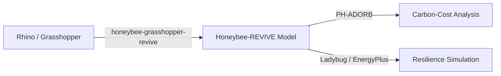

# Getting Started

Honeybee-REVIVE is a free plugin for [Ladybug Tools](https://www.ladybug.tools/) that adds
[Phius REVIVE](https://www.phius.org/phius-revive-2024) resilience and lifecycle carbon-cost
attributes to [Honeybee](https://github.com/ladybug-tools/honeybee-core) energy models.
It relies on the [PH-ADORB](https://github.com/PH-Tools/PH_ADORB) library to execute the
actual carbon-cost calculations.

> This plugin is not affiliated with or endorsed by Phius. It is neither reviewed nor
> approved by Phius for use in complying with the REVIVE program.

## Prerequisites

Honeybee-REVIVE extends the Ladybug Tools ecosystem. You will need:

- [Ladybug Tools](https://www.ladybug.tools/) v1.8 or higher
- [Rhino 3D v8+](https://www.rhino3d.com/) + Grasshopper (for the visual scripting workflow)
- [honeybee-grasshopper-revive](https://github.com/PH-Tools/honeybee_grasshopper_REVIVE) (Grasshopper components)

## Installation

Install from [PyPI](https://pypi.org/project/honeybee-REVIVE/):

```bash
pip install honeybee-revive
```

For Grasshopper usage, install via the Ladybug Tools plugin manager or follow the
[honeybee-grasshopper-revive](https://github.com/PH-Tools/honeybee_grasshopper_REVIVE) instructions.

## Typical Workflow



1. **Model** your building geometry in Rhino and assign REVIVE attributes using the
   [Grasshopper components](https://github.com/PH-Tools/honeybee_grasshopper_REVIVE).
2. **Simulate** resilience scenarios (extended power outages, extreme weather) via
   EnergyPlus with morphed weather files.
3. **Analyze** lifecycle carbon costs using [PH-ADORB](https://github.com/PH-Tools/PH_ADORB).

## Links

- [Source Code (GitHub)](https://github.com/PH-Tools/honeybee_REVIVE)
- [PyPI](https://pypi.org/project/honeybee-REVIVE/)
- [Passive House Tools](https://www.passivehousetools.com)
