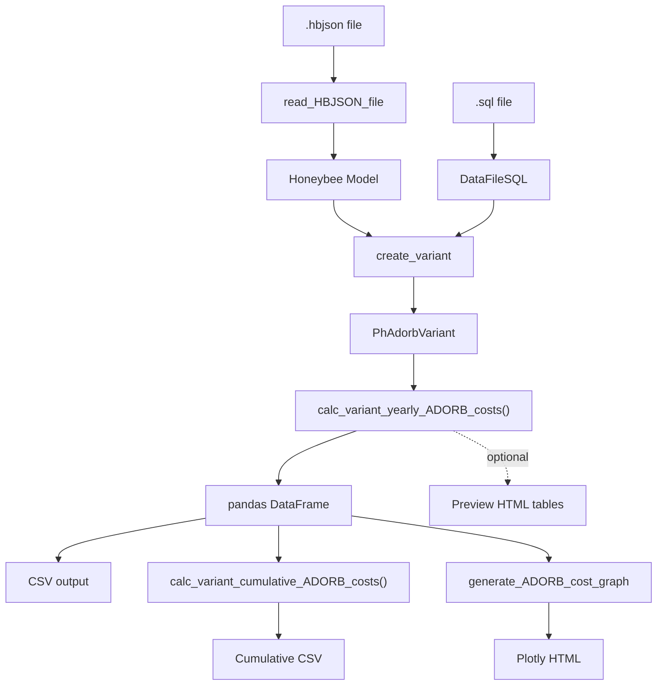

# Architecture

PH-ADORB is organized into three layers: **data model**, **calculation engine**, and
**I/O interfaces**.

## Module Map

```
ph_adorb/
  +-- Data Model (Pydantic / dataclass models)
  |   +-- variant.py          PhAdorbVariant — top-level container
  |   +-- constructions.py    PhAdorbConstruction, PhAdorbConstructionCollection
  |   +-- equipment.py        PhAdorbEquipment, PhAdorbEquipmentCollection
  |   +-- measures.py         PhAdorbCO2ReductionMeasure, PhAdorbCO2MeasureCollection
  |   +-- fuel.py             PhAdorbFuel, PhAdorbFuelType
  |   +-- grid_region.py      PhAdorbGridRegion (hourly CO2 factors by year)
  |   +-- national_emissions.py  PhAdorbNationalEmissions (kg CO2 / USD)
  |   +-- yearly_values.py    YearlyCost, YearlyKgCO2, YearlyPresentValueFactor
  |
  +-- Calculation Engine
  |   +-- adorb_cost.py       Present-value cost functions, calculate_annual_ADORB_costs()
  |   +-- variant.py          calc_variant_yearly_ADORB_costs(), orchestrator
  |
  +-- I/O
  |   +-- ep_sql_file.py      DataFileSQL — reads EnergyPlus .sql results
  |   +-- from_HBJSON/        Converts Honeybee-REVIVE models to PhAdorbVariant
  |   |   +-- read_HBJSON_file.py   Load and parse .hbjson files
  |   |   +-- create_variant.py     Extract constructions, equipment, fuels, measures
  |   +-- tables/variant.py   Preview tables (Rich console + HTML export)
  |   +-- run/                CLI entry-point scripts
  |       +-- calc_HBJSON_ADORB_costs.py     Full pipeline: HBJSON -> CSV
  |       +-- generate_ADORB_cost_graph.py   CSV -> Plotly HTML graph
```

## Data Flow



## Key Classes

### PhAdorbVariant

The top-level container for a single building design variant. Holds all input data
needed to compute ADORB costs:

- Energy consumption (hourly electricity, total gas)
- Fuel pricing (`PhAdorbFuel` for electricity and gas)
- Grid region CO2 factors (`PhAdorbGridRegion`)
- National emissions intensity (`PhAdorbNationalEmissions`)
- Construction assemblies (`PhAdorbConstructionCollection`)
- Mechanical equipment and appliances (`PhAdorbEquipmentCollection`)
- CO2 reduction measures (`PhAdorbCO2MeasureCollection`)
- Analysis parameters (duration, carbon price, labor fraction)

### Collections

Constructions, equipment, and CO2 measures each follow the same pattern:
a **model class** (single item) and a **collection class** (dict-backed, iterable,
sortable). Collections are populated during the HBJSON import step.

### DataFileSQL

Reads EnergyPlus `.sql` result files via `sqlite3` to extract:
- Peak electrical demand (W)
- Hourly purchased electricity (kWh)
- Total purchased / sold electricity (kWh)
- Total purchased gas (kWh)

## Calculation Pipeline

The main entry point is `calc_variant_yearly_ADORB_costs()` in `variant.py`, which:

1. Computes annual electricity and gas costs
2. Computes annual CO2 emissions (hourly electric via grid region factors, gas via fixed factor)
3. Computes yearly embodied kgCO2 and install costs for constructions, equipment, and CO2 measures — accounting for component lifetimes and replacement cycles
4. Passes all yearly costs to `adorb_cost.calculate_annual_ADORB_costs()`, which applies present-value discounting to produce a DataFrame with five cost columns:
   - `pv_direct_energy` — energy purchase costs (2% discount rate)
   - `pv_operational_CO2` — operational carbon costs (7.5% discount rate)
   - `pv_direct_MR` — maintenance & replacement costs (2% discount rate)
   - `pv_embodied_CO2` — embodied carbon costs (0% discount rate)
   - `pv_e_trans` — grid transition costs (2% discount rate)
