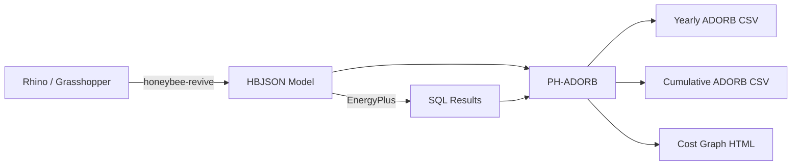

# Getting Started

PH-ADORB calculates the **A.D.O.R.B. cost** (Annualized De-carbonization Of Retrofitted
Buildings) for building projects. It produces a "full-cost-accounted" annualized
life-cycle cost metric that includes:

- **Direct energy costs** — electricity and gas purchase costs
- **Operational carbon costs** — CO2 emissions priced at a social cost of carbon
- **Direct maintenance & replacement costs** — construction, equipment, and CO2-reduction measure install costs over their lifetimes
- **Embodied carbon costs** — upstream CO2 from materials, priced at a social cost of carbon
- **Grid transition costs** — the building's share of national renewable energy infrastructure investment

> This library is not affiliated with or endorsed by Phius. It is neither reviewed nor
> approved by Phius for use in complying with the REVIVE program.

## Prerequisites

PH-ADORB takes input from [Honeybee-REVIVE](https://github.com/PH-Tools/honeybee_REVIVE)
models and EnergyPlus simulation results. You will need:

- Python 3.10+
- A Honeybee-REVIVE model (`.hbjson` file) with REVIVE attributes assigned
- An EnergyPlus simulation results file (`.sql`) with hourly output variables enabled
- [Ladybug Tools](https://www.ladybug.tools/) v1.8+ (for model creation)

## Installation

Install from [PyPI](https://pypi.org/project/PH-ADORB/):

```bash
pip install PH-ADORB
```

## Typical Workflow



1. **Model** your building in Rhino and assign REVIVE attributes (constructions, equipment,
   fuels, CO2 measures, grid region) using the
   [Grasshopper components](https://github.com/PH-Tools/honeybee_grasshopper_REVIVE).
2. **Simulate** the model with EnergyPlus to produce an `.sql` results file with hourly
   purchased-electricity output variables.
3. **Run PH-ADORB** to calculate annualized lifecycle costs, either via the CLI scripts
   or the Python API.

## Quick Example (Python API)

```python
from pathlib import Path
from ph_adorb.from_HBJSON import create_variant, read_HBJSON_file
from ph_adorb.variant import calc_variant_yearly_ADORB_costs

# Load the Honeybee Model
hb_dict = read_HBJSON_file.read_hb_json_from_file(Path("model.hbjson"))
hb_model = read_HBJSON_file.convert_hbjson_dict_to_hb_model(hb_dict)

# Build the ADORB Variant from the model + EnergyPlus results
variant = create_variant.get_PhAdorbVariant_from_hb_model(
    hb_model, Path("results.sql")
)

# Calculate yearly ADORB costs -> pandas DataFrame
df = calc_variant_yearly_ADORB_costs(variant)
df.to_csv("adorb_costs.csv")
```

## Links

- [Source Code (GitHub)](https://github.com/PH-Tools/PH_ADORB)
- [PyPI](https://pypi.org/project/PH-ADORB/)
- [Passive House Tools](https://www.passivehousetools.com)
- [Honeybee-REVIVE](https://github.com/PH-Tools/honeybee_REVIVE) (upstream data model)
